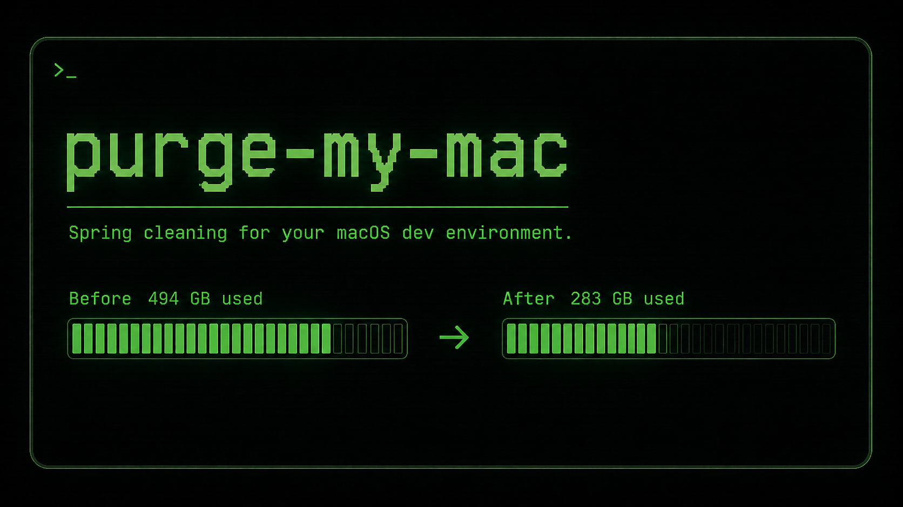

# purge-my-mac

A little spring cleaning for your macOS development environment. Reclaim space from Docker, package managers, Xcode, VS Code, and more with clear, animated output and zero dependencies.

## Install

Copy and paste this into Terminal:

```bash
curl -fsSL https://raw.githubusercontent.com/raulcanodev/purge-my-mac/main/install.sh | bash
```

Then run:

```bash
purge-my-mac
```


> Want to look before touching anything? Run `purge-my-mac --dry-run`.

## Usage

```bash
purge-my-mac             # run the full cleanup
purge-my-mac --dry-run   # preview without deleting anything
purge-my-mac --help      # show all options
```

The cleanup removes unused Docker resources and regenerable caches from pnpm, npm/npx, Yarn, Homebrew, pip, Playwright, Cypress, Electron, CocoaPods, TypeScript, Xcode, and VS Code. It preserves your VS Code settings, keybindings, and extensions, but removes caches and `workspaceStorage`.

## Update or uninstall

Run the installation command again to update. To uninstall:

```bash
rm ~/.local/bin/purge-my-mac
```

## Compatibility and safety

- Built for macOS and compatible with the system Bash.
- Only removes regenerable caches and unused Docker resources.
- Keeps going when a tool fails and displays the error instead of hiding it.
- Respects [`NO_COLOR`](https://no-color.org/) and disables animations when output is redirected.

The reported savings compare free disk space before and after the run. Other processes may slightly affect the result.

## Development

```bash
bash -n purge-my-mac install.sh
./purge-my-mac --dry-run --no-color
```

MIT
